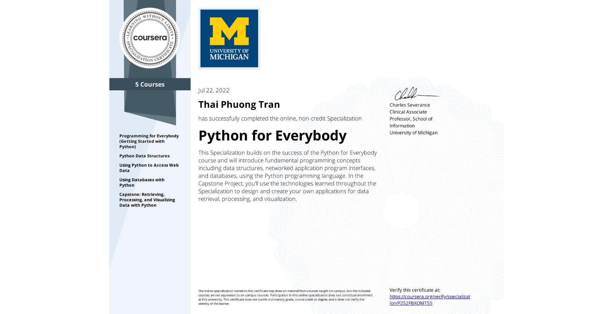
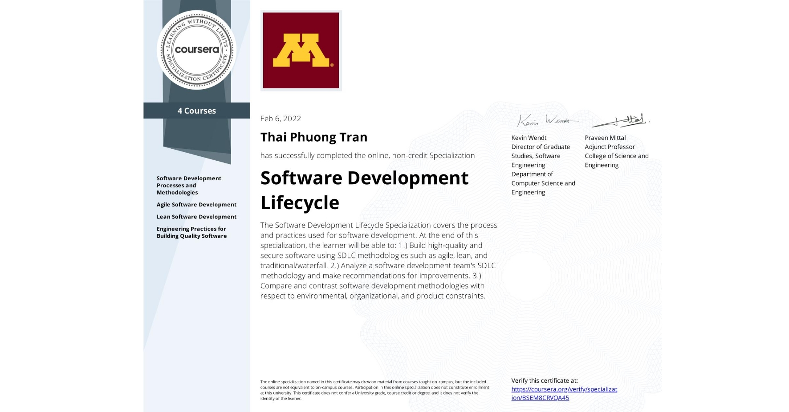
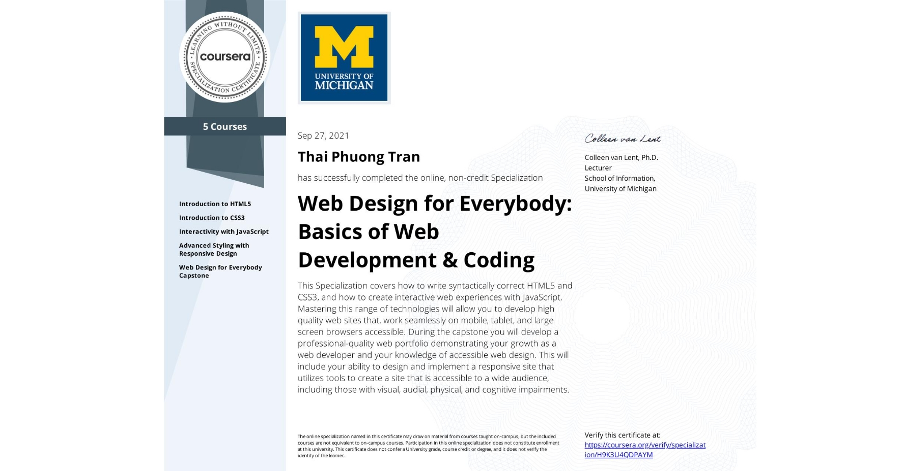
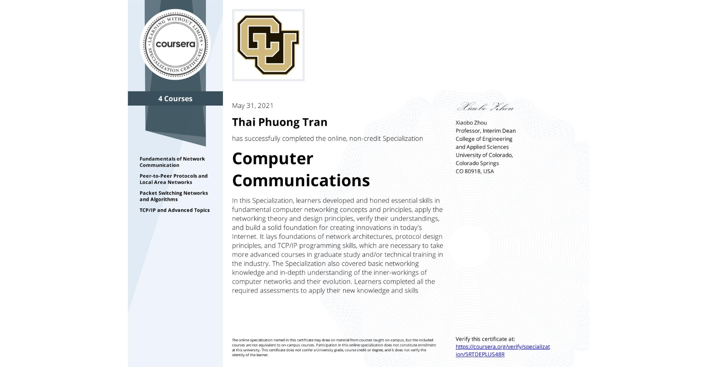

<h1 align="center">Hi 👋, I'm Phuong Thai</h1>

<h3 align="center">A passionate developer from Vietnam </h3>

- ✍ I'm a student of: [FPT University](https://hcmuni.fpt.edu.vn/) (FPTU).

- 🌱 I’m currently learning **MERN Stack.**

## 📫 How to reach me:

  
   
   
  
  
  

## Skills:

   
  
  
  
  
  
  
  
  
  
  
  

<table style="width:100%;">
  <tr>
    <td>
      
      
    </td>
    <td>
      
 
        
      

    </td>
  </tr>
</table>

# Certificates:
 Python for Everybody:

  
  
 CertNexus Certified Ethical Emerging Technologist Professional Certificate:

  
  
   Software Development Lifecycle:
  

  
  
   Web Design for Everybody: Basics of Web Development & Coding:
    

  
  
  
   Computer Communications:
      

  
  
   Academic Skills for University Success:
        

  
  

